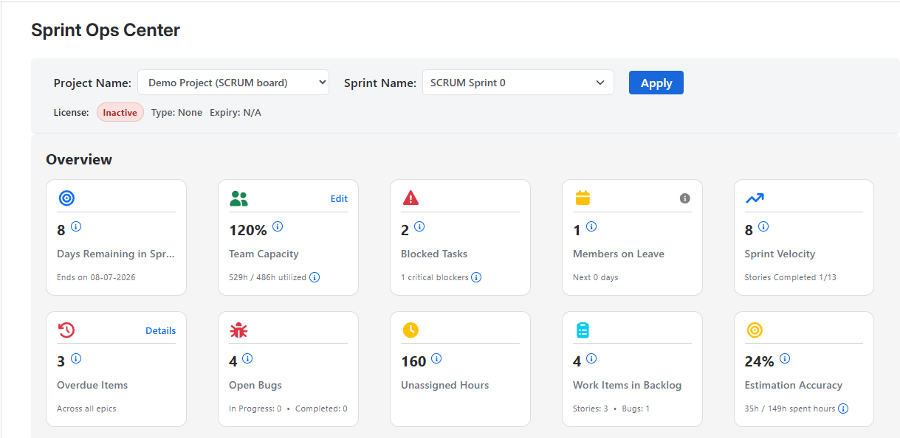
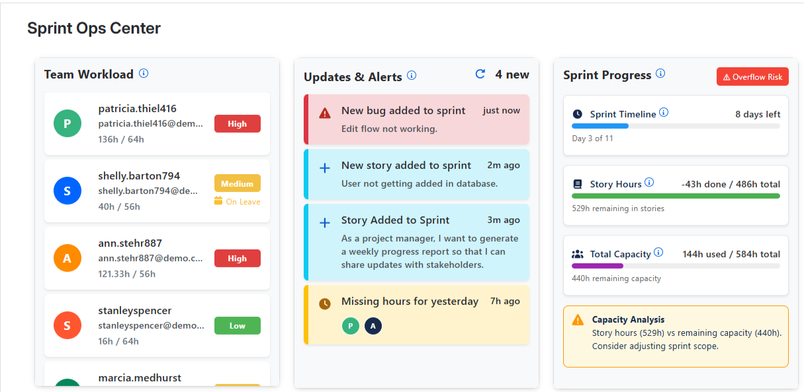
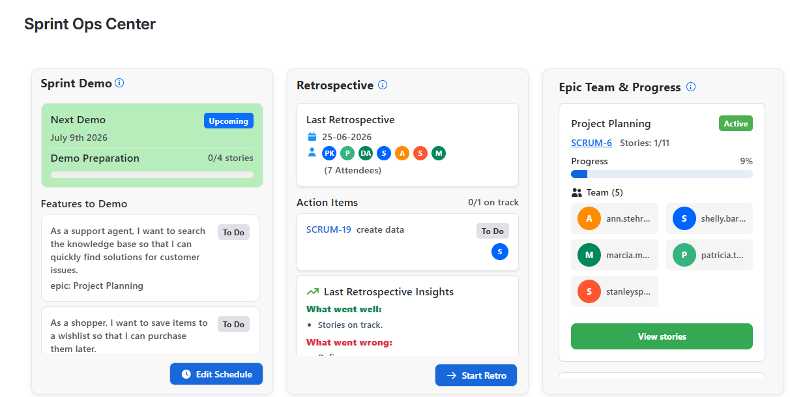
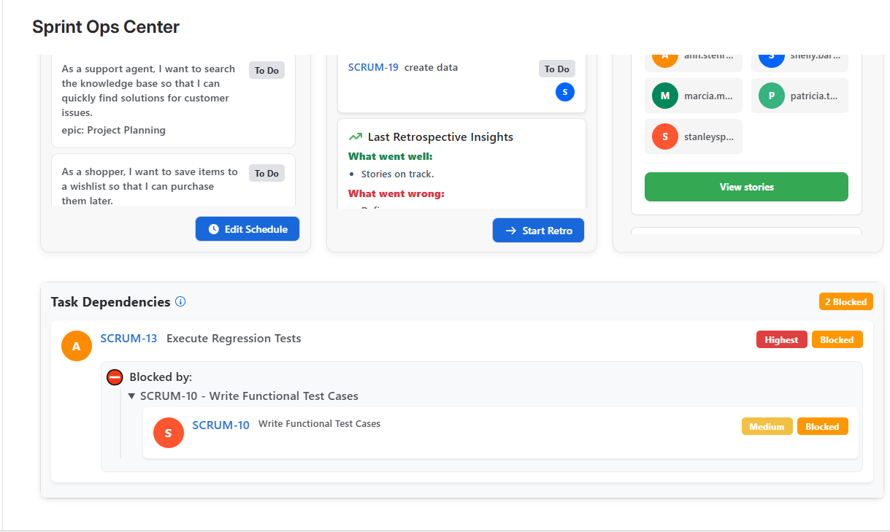

# Sprint Ops Center Documentation

## Overview

Sprint Ops Center is a sprint analytics and operations app for Jira, designed primarily for project managers who need a clear view of how an active sprint is progressing.

The app helps teams monitor sprint health, identify issues early, catch delivery risks before they escalate, and make better decisions throughout sprint execution. By selecting a Jira project and an active sprint, users can generate focused insights based only on the data available within that sprint.

## Who It Is For

Sprint Ops Center is built for teams that want stronger visibility into sprint execution, especially:

- Project managers
- Scrum masters
- Engineering managers
- Team leads
- Delivery managers

It is especially useful for teams that want one place to review sprint progress, team workload, blockers, demos, retrospective actions, and delivery risks.

## Key Features

### Sprint overview insights

Sprint Ops Center provides a high-level summary of the most important sprint metrics so teams can quickly understand sprint health.

This includes insights such as:

- Days remaining in the sprint
- Bug counts
- Blocked tasks
- Overdue work items
- Team capacity overview
- Unassigned or missing hours
- Work items in backlog
- Estimation accuracy
- Sprint velocity indicators

These numbers help managers quickly identify whether the sprint is on track or needs immediate attention.

### Team capacity management

The app allows teams to configure available hours for each team member so sprint insights can be interpreted in the right context.

With team capacity configured, managers can:

- Compare remaining story hours against remaining team capacity
- Detect overload risk early
- Understand whether the current sprint scope is realistic
- Make better assignment and prioritization decisions

### Individual workload visibility

Sprint Ops Center shows workload distribution for each team member in the sprint.

This helps managers identify who is:

- Lightly loaded
- Appropriately loaded
- Heavily loaded
- On leave or unavailable

This visibility makes it easier to rebalance assignments and reduce delivery bottlenecks.

### Updates and alerts

The app surfaces important sprint events and operational alerts so teams can react faster.

Examples include:

- New bugs added to the sprint
- New stories added to the sprint
- Missing logged hours from team members
- Important sprint activity updates

These alerts help managers stay aware of changes that can affect sprint delivery.

### Sprint progress analysis

Sprint Ops Center provides insights into how the sprint is progressing against available team capacity.

This includes:

- Sprint timeline progress
- Remaining sprint hours
- Total team capacity
- Capacity analysis
- Delivery risk indicators such as overflow risk

By comparing remaining work with remaining capacity, the app helps teams make informed scope and execution decisions.

### Epic-wise team and progress tracking

The app allows users to review progress at the epic level within the selected sprint.

This helps teams:

- Understand how much progress has been made for each epic
- See which team members are contributing to an epic
- Identify epics that are lagging behind
- Review associated stories directly from the epic view

### Task dependency visibility

Sprint Ops Center shows dependencies between sprint tasks so blockers can be identified and resolved earlier.

This helps managers understand:

- Which tasks are blocked
- What each task is blocked by
- Which dependencies are creating delivery risk
- Which items need intervention first

This is especially useful in active sprints where unresolved dependencies can delay multiple stories.

### Sprint demos

The app allows teams to create sprint demos and assign stories to them to track demo readiness.

This helps teams:

- Prepare for sprint review more effectively
- See which stories are ready for demonstration
- Track demo preparation progress in one place

At present, each sprint supports one demo.

### Retrospectives and action items

Sprint Ops Center allows teams to conduct sprint retrospectives within the app.

Teams can capture:

- What went well
- What went wrong
- Improvement action items

For each retrospective action item, the app automatically creates a Jira story in the backlog so follow-up work is not lost after the retrospective.

## How to Use

### Generate sprint insights

1. Open Sprint Ops Center from Jira.
2. Select a project.
3. Select an active sprint from the sprint dropdown.
4. Click **Apply**.

Only active sprints are shown in the sprint selection dropdown.

Once applied, the app gathers all relevant stories and users from the selected sprint and generates insights limited to that sprint.

### Configure team capacity

For first-time use, some insights may appear blank because team capacity has not yet been configured.

To configure team capacity:

1. Open the team capacity configuration option.
2. Add the available hours for each team member.
3. Save the changes.

After team capacity is configured, additional insights become available and sprint analysis becomes more accurate.

### Create sprint demos

Teams can create a sprint demo and assign sprint stories to it.

This makes it easier to track demo readiness and review which stories are prepared for presentation.

At this time, each sprint supports a single demo.

### Run retrospectives

Teams can create a retrospective for the sprint and capture the discussion outcomes.

Each action item from the retrospective is automatically converted into a Jira story in the backlog, helping teams turn discussion into follow-up work.

## First-Time Setup Notes

When using Sprint Ops Center for the first time, it is normal for some sections to show limited or blank data until the required sprint inputs are available.

To get the best results:

- Select a project with an active sprint
- Ensure sprint stories are available in Jira
- Configure team member capacity
- Review workload and logged-hour data regularly

Once these are set up, the app can provide a much more complete sprint operations view.

## Screenshots

### Main sprint selection and overview

The main screen allows users to select a project, choose an active sprint, and apply the selection to generate sprint-specific analytics.

### Team workload, updates, and sprint progress

This view highlights workload distribution, important sprint alerts, and capacity-based sprint progress analysis.

### Sprint demo, retrospective, and epic progress

This section shows demo planning, retrospective insights, action items, and epic-level team progress.

### Task dependencies

The dependency view helps managers understand blocked tasks and the relationships that may delay sprint execution.

## Best Practices

To get the most value from Sprint Ops Center:

- Review sprint insights early and regularly during the sprint
- Keep team capacity updated when availability changes
- Monitor blocked tasks before they impact multiple stories
- Use workload insights to rebalance assignments early
- Track demo readiness before sprint review meetings
- Convert retrospective actions into backlog follow-up and review them in the next sprint

## Notes

- Insights are generated based on the selected project and active sprint.
- Only active sprints are available for selection in the sprint dropdown.
- Some analytics depend on team capacity being configured.
- Each sprint currently supports one demo.

## Support

For support, setup assistance, feature requests, or feedback, please contact the Sprint Ops Center support team at developer@isynergytech.com
